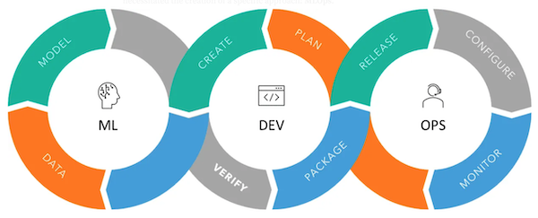

  

# <h1 align=center>Proyecto Individual Nº 1 - MLOps Steam</h1>

  

Desarrollado por Ana Paulina Maya Cohorte 18

El objetivo de este proyecto es situarnos en el rol de un MLOps Engineer, el cual combina las funciones de un Data Engineer y un Data Scientist. Partimos de un dataset compuesto por tres bases de datos de la plataforma Steam. Debemos realizar un Analísis exploratorio de los datos -EDA- y un proceso de Extracción, Transformación y disponibilización de dichos datos -ETL-.

Se ha solicitado un Producto Mínimo Viable que consiste en una API deployada en un servicio en la nube, que permita realizar unas consultas dadas y la aplicación de un Modelo de Machine Learing para un sistema de recomendación.

## Datos

Para este proyecto se nos entregaron [tres archivos JSON](https://drive.google.com/drive/folders/1HqBG2-sUkz_R3h1dZU5F2uAzpRn7BSpj):

-  steam_games.json es un dataset que contiene datos relacionados con las características de los juegos, como su título, el desarrollador, precio, géneros, especificaciones, url, fecha de lanzamiento, entre otros.

- user_reviews.json es un dataset que contiene los comentarios realizados por los usuarios sobre los juegos que han utilizado, además de datos adicionales como si recomiendan o no ese juego, o si el comentario fue encontrado útil o divertido. También incluye el id del usuario que realiza la reseña con su url del perfil.

- users_items.json es un dataset que contiene información sobre los juegos que han sido adquiridos por cada usuario, así como el tiempo acumulado de juego para cada uno de ellos.

## Tareas Desarrolladas

### ETL

Para comenzar era necesario extraer la información almacenada en cada dataset. Estos traían algunos datos anidados, es decir había columnas con diccionarios o listas de diccionarios, por lo que se aplicaron distintas estrategias para transformar esta información anidada en columnas. El proceso de ETL realizado con cada archivo se encuentra detallado en el notebook [ETL](ETL.ipynb). Se revisaron datos nulos y duplicados. Se unificaron los nombres de las columnas y los tipos de datos. Se eliminaron las columnas que no se iban a utilizar en las consultas de la API. Finalmente cada dataset fue almacenado en un archivo tipo parquet.

### EDA

Después del ETL pasamos a hacer un análisis exploratorio de los datos en el cual el enfoque estuvo en análisis estadísiticos, revisión de outliers y relaciones entre variables. Lo que se buscaba con este proceso era identificar las variables a utilizar para el modelo de recomendación y la construcción de un dataset específico para el modelo de Machine Leraning. Este proceso se encuentra debidamente detallado y comentado en el notebook [EDA](EDA.ipynb)

### Modelo de Machine Learning

### Desarrollo de la API

La aplicación desarrollada es de tipo API Rest y fue creada a través del framework FastApi.

Contiene 5 funciones de consulta de datos -Endpoints-, y una que devuelve recomendaciones al usuario utilizando el modelo de Machine Learning entrenado.

Los endpoints solicitados fueron los siguientes:

- PlayTimeGenre: Recibe un género y debe devolver el año con mas horas jugadas para dicho género.

- UserForGenre: Recibe un género y debe devolver el usuario que acumula más horas jugadas para el género dado y una lista de la acumulación de horas jugadas por año.

- UsersRecommend: Recibe un año y devuelve el top 3 de juegos MÁS recomendados por usuarios para ese año. Se toman como recomendaciones los valores True en la columna reviews.recommend = True y  los comentarios positivos/neutrales según la columna reviews.Sentiment_analysis

- UsersWorstDeveloper: Recibe un año y devuelve el top 3 de desarrolladoras con juegos MENOS recomendados por usuarios para el año dado. Se toman los casos en que reviews.recommend = False y reviews.Sentiment_analysis muestra comentarios negativos

- Sentiment_analysis: Según la empresa desarrolladora, se devuelve un diccionario con el nombre de la desarrolladora como llave y una lista con la cantidad total de registros de reseñas de usuarios que se encuentren categorizados con un análisis de sentimiento como valor.

El desarrollo de estos endpoints se puede encontrar detallado en el notebook [Endpoints](Endpoints.ipynb)

El código para la API, que funcionó de manera local, se encuentra en el archivo [main.py](main.py)

### Deployment

La aplicación se encuentra disponible en [el siguiente enlace](https://api-steam-deploy-6jck.onrender.com/docs)

Para el deploy de la API se utilizó la plataforma Render que es una nube unificada para crear y ejecutar aplicaciones y sitios web, permitiendo el despliegue automático desde GitHub. Dado que el servicio gratuito cuenta con una limitada capacidad de almacenamiento, se realizó un repositorio exclusivo para el deploy, el cual [se encuentra aquí](https://github.com/anapmaya/api-deploy)

También, debido a la limitación mencionada anteriormente, fue necesario reducir el tamaño del dataset user_items. Se generó un nuevo archivo tomando únicamente la mtad de los registros del original. Tengo claro que eso influirá directamente en los resultados de algunas consultas pero fue la solución que decidí adoptar para lograr el producto mínimo viable solicitado.

## Video

En [este video] se explica brevemente este proyecto mostrando el funcionamiento de la API.
